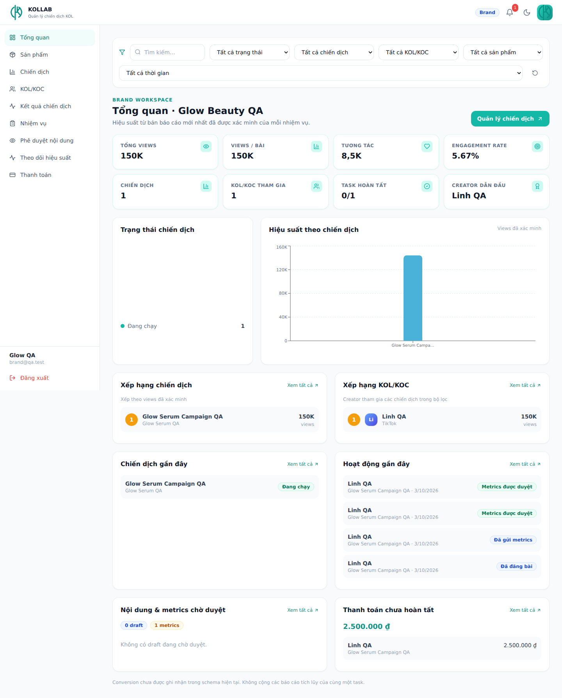
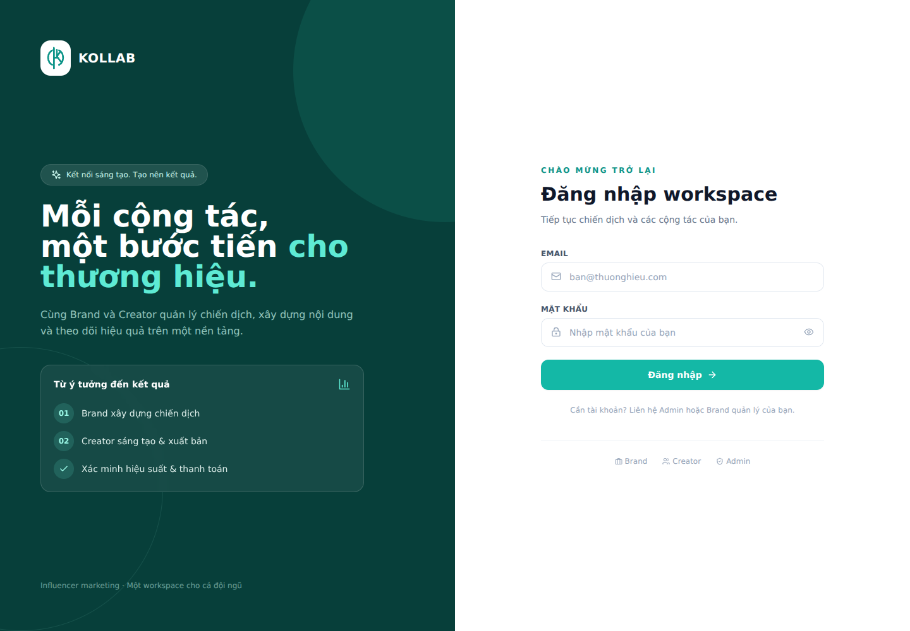
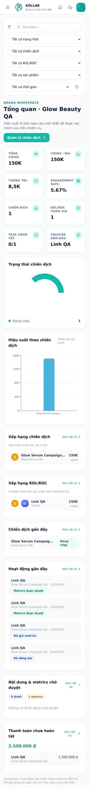

# Kiểm thử bản nâng cấp — 03/10/2026

- `npm run typecheck`: PASS.
- `npm run lint`: 0 errors; 3 cảnh báo Fast Refresh về constants cùng file component SharedUI (cấu trúc gốc).
- `npm run build`: PASS; lazy load theo role và tách React/charts/motion/Supabase. Không còn cảnh báo chunk lớn.
- SQL trên PGlite/Postgres riêng: chạy migration hai lần, notification assignment/draft/revision/published/metrics/payment đúng vai; read state; không trùng sự kiện khi update cùng status; Admin provision hai bảng; email trùng/role sai bị chặn; lỗi insert brands rollback users.
- Analytics: chỉ chọn snapshot verified mới nhất, tie-break ID, không cộng snapshot tích lũy, loại rejected/pending ở chế độ verified, loại cancelled/khác campaign khỏi hiệu suất, giữ chi phí đã trả, số dạng numeric string, target 0 và dữ liệu thiếu.
- Chromium với bản Vite production và transport Supabase giả lập: login, Brand dashboard, header avatar, upload sản phẩm, từ chối file không phải ảnh, tìm kiếm/status filter, chuông/read/navigate, outcome verified vs pending, viewport mobile không tràn ngang, profile mobile, Admin tạo Brand qua RPC, KOL avatar save/filter, routing KOC. Không có lỗi JavaScript runtime.

Các fixture chỉ nằm trong môi trường kiểm thử, không được đưa vào business logic. Chưa chạy migration hoặc ghi dữ liệu lên Supabase live. Kiểm thử schema riêng chứng minh logic SQL với các cột được dùng, không thay thế kiểm tra constraint/RLS cụ thể của database đang chạy. Luồng demo trong README_UPGRADE.md là bước xác nhận trên project thật.

## Xem trước giao diện

Dữ liệu trong ảnh là fixture QA, không phải bản ghi đã tạo trên database của bạn.

## Regression cho lỗi thực tế

Chuẩn hóa object/array/null/undefined cho payments, published_posts, draft_submissions và performance_metrics; giữ nguyên tổng paid/outstanding, views và số bài đăng. Browser regression dùng payload payments/posts dạng object như join one-to-one; xác nhận dashboard/outcome/portal không còn `.reduce is not a function`. Notifications thiếu relation/cột hiện lỗi thiết lập thay vì crash; dừng polling lặp lại và manual retry phục hồi sau khi bảng sẵn sàng. SQL migration có reload schema và vẫn chạy lại được.
